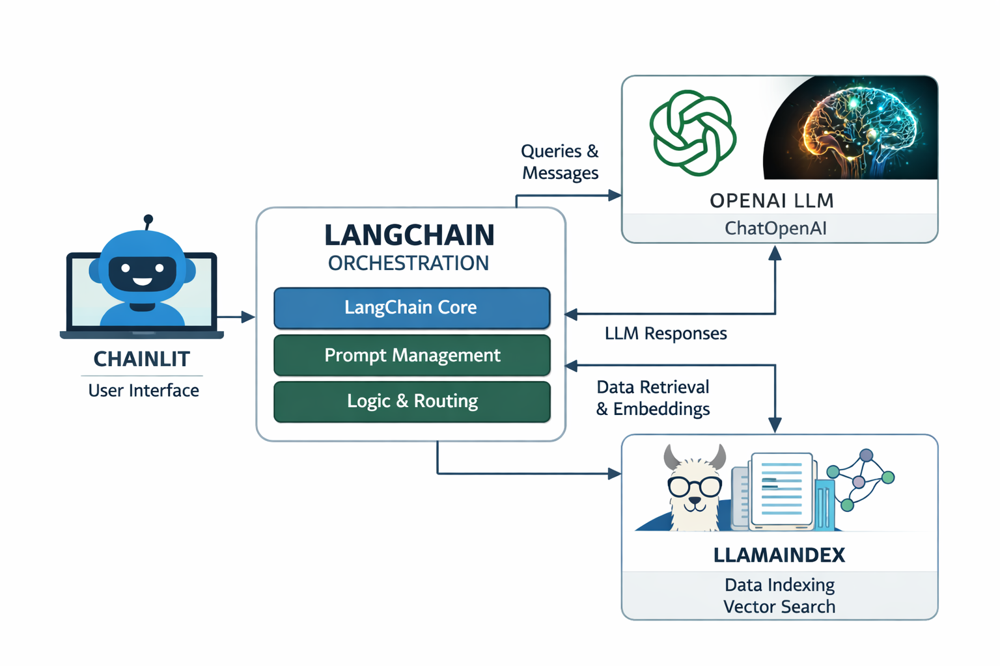

# AI Playground

A simple Retrieval-Augmented Generation (RAG) chatbot built with Chainlit, LlamaIndex, and LangChain. This project demonstrates how to create an AI-powered chat interface that answers questions based on a knowledge base using vector search and large language models.


## Features

- **Interactive Chat Interface**: Built with Chainlit for a modern, responsive chat experience
- **Vector Search**: Uses LlamaIndex for efficient document indexing and similarity search
- **LLM Integration**: Powered by OpenAI's GPT models through LangChain
- **Docker Support**: Containerized deployment for easy setup and scalability
- **In-Memory Demo**: Includes sample documents for immediate testing



## Prerequisites

- Windows Subsystem for Linux (WSL) or Linux/Mac environment
- [Docker Desktop](https://www.docker.com/products/docker-desktop/) or [Rancher Desktop](https://rancherdesktop.io/)
- [make](https://gnuwin32.sourceforge.net/packages/make.htm) (or install via Chocolatey: `choco install make`)
- OpenAI API key (for LLM functionality)

## Quick Start

1. **Clone the repository**
   ```bash
   git clone https://github.com/your-username/ai_playground.git
   cd ai_playground
   ```

2. **Set up environment variables**
   - Copy the `.env.example` file to `.env` in project root
   - Add your OpenAI API key:
     ```
     OPENAI_API_KEY=your_openai_api_key_here
     ```

3. **Start Docker Desktop/Rancher Desktop**

4. **Build and run the application**
   ```bash
   make chainlit.up-build
   ```

5. **Open your browser** and navigate to `http://localhost:8000`

## Usage

Once the application is running, you can:

- Ask questions about the sample documents (Breaking Bad and Lord of the Rings)
- The system will retrieve relevant context using vector search
- Get AI-generated answers based on the retrieved information

Example queries:
- "Tell me about Breaking Bad"
- "What is the Lord of the Rings about?"
- "Who is Walter White?"

## Tech Stack

- **[Chainlit](https://docs.chainlit.io/get-started/overview)**: Chat interface framework
- **[LlamaIndex](https://developers.llamaindex.ai/python/framework/getting_started/starter_example/)**: Vector indexing and retrieval
- **[LangChain](https://docs.langchain.com/)**: LLM orchestration and chaining
- **[FastMCP](https://gofastmcp.com/getting-started/welcome)**: Additional MCP tools integration
- **Docker**: Containerization for consistent deployment

## Development

### Available Make Commands

- `make chainlit.build` - Build the Docker image
- `make chainlit.up` - Start the container
- `make chainlit.up-build` - Build and start the container
- `make chainlit.down` - Stop the container
- `make chainlit.restart` - Restart the container
- `make chainlit.rebuild` - Force rebuild and restart
- `make chainlit.logs` - View container logs
- `make help` - Show all available commands

### Local Development

For local development without Docker:

1. Install dependencies:
   ```bash
   cd chainlit/src
   pip install -r requirements.txt
   ```

2. Set your OpenAI API key as an environment variable

3. Run the application:
   ```bash
   chainlit run app.py
   ```

## License

This project is licensed under the MIT License - see the [LICENSE](LICENSE) file for details.

## Acknowledgments

- Built with [Chainlit](https://chainlit.io/)
- Powered by [OpenAI](https://openai.com/)
- Inspired by modern RAG implementations